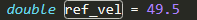
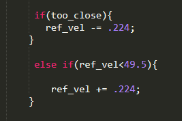
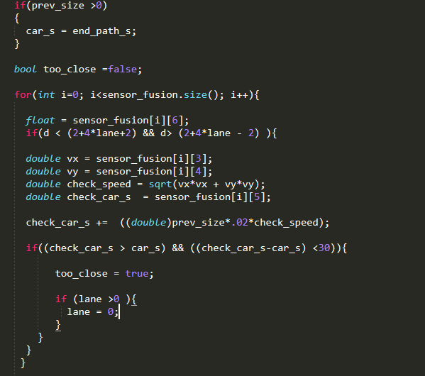

1-I have used a refrenced velocity of 49.5 miles/sec and I have not make it to increase from 0 to the refrenced velocity at once 
because it will make the acceleration and jerk very high so I made the velocity to increase gradually so that  acceleration and jerk will not increase at very high rate istead of that it will increase in low rate.the main thing that made me do this that this will more comfortable to people who ride the car.If I let the car move it will collide after a while to solve this problem I have put a range I have estimated it by 30 m   that if the car exceed this limit the velocity of the car will be decreased gradually So that car will move and it will avoid colliding with the car in the front of it.


```python
from IPython.display import Image 
Image(filename = "4.png" ,width = 400, height = 400)
```





```python
from IPython.display import Image 
Image(filename = "1.png" ,width = 400, height = 400)
```





3- If I keep slow down when I see car move slowly in the front of me it will not be acceptable and not efficient so I have to 
change lane in this case I trace if there is any car move in this lane to avoid collide with it then when I check It’s safe I 
will change the lane.I will see the left lane if it not safe I will change lane for the right lane if it’s also not safe I will
keep lane until any lane be safe to me.


```python
from IPython.display import Image 
Image(filename = "3.png" ,width = 400, height = 400)
```





